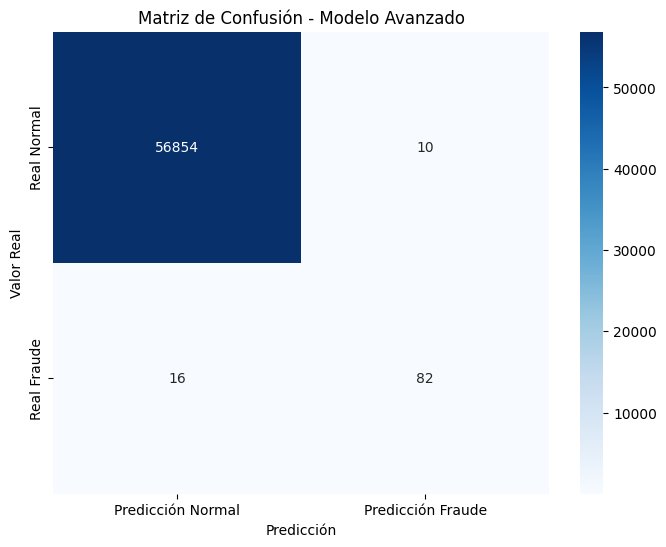
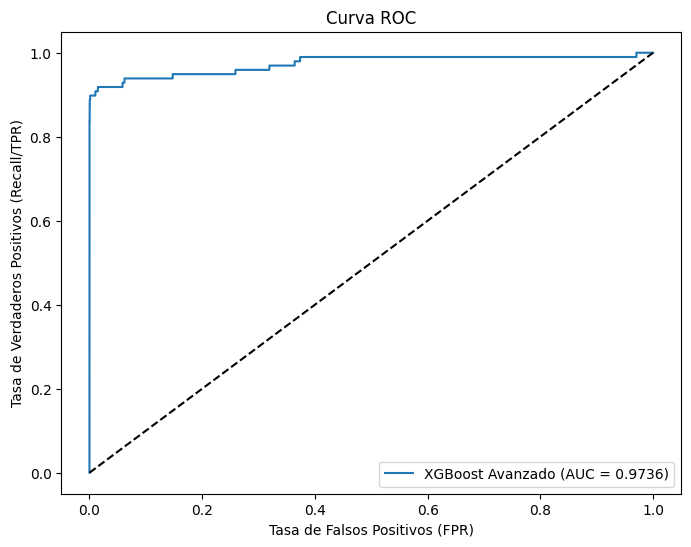
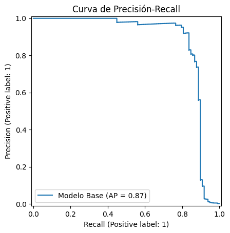

# Project: Credit Card Fraud Detection with KNIME and Python

## 1. Executive Summary

This project addresses the challenge of detecting fraudulent transactions within a highly imbalanced credit card dataset. A hybrid methodology was implemented, leveraging **KNIME Analytics Platform** for rapid prototyping, preprocessing, and optimization of a baseline model. Subsequently, **Python** (with `scikit-learn` and `XGBoost`) was used to perform advanced feature engineering to refine and improve the model.

The final result is a robust Python-based model that, thanks to sophisticated feature engineering on time and amount variables, achieved a **Recall of 83.7%** in fraud detection, surpassing the solid benchmark established in KNIME.

---
## 2. The Problem: The Challenge of Imbalanced Data

The project started with a public dataset from Kaggle containing 284,807 transactions, of which only **492 (a mere 0.17%)** were fraudulent. This extreme class imbalance is the primary technical challenge, as a naive model could achieve over 99% accuracy by simply classifying all transactions as "normal," rendering it useless for the business.

The main objective, therefore, was to maximize the **Recall** metric (the ability to find as many fraudulent transactions as possible) while maintaining an acceptable Precision to minimize false positives.

---
## 3. Hybrid Methodology: KNIME + Python

The project was strategically divided into two phases to leverage the best of both tools:

* **Phase 1 (KNIME):** Utilized KNIME's visual, low-code interface to rapidly explore the data, build a preprocessing pipeline, and train advanced models (including hyperparameter optimization) to establish a solid benchmark and validate the project's feasibility.

* **Phase 2 (Python):** Migrated the workflow to a Jupyter Notebook in a VSCode environment to apply more complex **Feature Engineering** techniques, gain granular control over the model, and demonstrate proficiency in an industry-standard development environment.

---
## 4. Phase 1: Prototyping and Optimization in KNIME

A complete and robust workflow was built in KNIME to clean the data, handle the class imbalance using `SMOTE`, and find the optimal hyperparameters for an `XGBoost` model via the `Parameter Optimization Loop`.

This process allowed us to establish a highly competitive initial benchmark, confirming the viability of the approach and the choice of algorithm.

---
## 5. Phase 2: Refinement and Improvement in Python

In this phase, the workflow was replicated and enhanced in Python.

**Mapping KNIME Nodes to Python Code:**

| Task | KNIME Node(s) | Python Equivalent |
| :--- | :--- | :--- |
| **Data Loading** | `CSV Reader` | `pandas.read_csv()` |
| **Preprocessing**| `Column Filter`, `Normalizer` | `df.drop()`, `StandardScaler()` |
| **Partitioning** | `Table Partitioner` | `train_test_split(stratify=y)` |
| **Balancing** | `SMOTE` | `imblearn.over_sampling.SMOTE` |
| **Training** | `XGBoost Tree Ensemble Learner` | `XGBClassifier().fit()` |
| **Evaluation** | `Scorer (JavaScript)` | `classification_report`, `roc_auc_score` |

The key improvement in the Python phase was **Feature Engineering**, where new predictive features were created from existing columns:

* **Cyclical Time Features:** The `Time` column was transformed into `Hour_sin` and `Hour_cos` to represent the cyclical nature of a 24-hour day, allowing the model to capture temporal patterns.
* **Zero-Amount Flag:** A new `Amount_es_cero` column was created to flag transactions with a zero amount, a potential indicator of fraudulent card testing.

---
## 6. Results and Final Model Comparison

The following table summarizes the model's performance evolution throughout the project, demonstrating the value added at each stage.

| Model | Tool | Recall (Frauds Captured) | Precision (Alert Quality) |
| :--- | :--- | :--- | :--- |
| 1. Random Forest (Base) | KNIME | 75.5% | 91.4% |
| 2. XGBoost Optimized | KNIME | 80.6% | 88.8% |
| 3. **XGBoost + Feat. Eng.** | **Python** | **83.7%** (82 of 98) | **89.1%** (82 of 92) |

---
## 7. Key Visualizations of the Winning Model (Python)

The following visualizations summarize the performance of the final, advanced Python model:

* **Visual Confusion Matrix:** Clearly shows the model's performance. Of the 98 fraudulent transactions in the test set, the model **successfully identified 82**, missed only 16, and generated just 10 false alarms.

    

* **ROC Curve:** Evaluates the overall performance of the classifier. The model achieved an outstanding **Area Under the Curve (AUC) of 0.9736**, very close to a perfect model (1.0).

    

* **Precision-Recall Curve:** This curve is particularly important for imbalanced datasets. The model maintains high precision as recall increases, achieving an **Area Under the Curve (AP) of 0.87**, which confirms its robustness.

    

---
## 8. How to Replicate this Project

1.  **KNIME Environment:** The workflow `02_Modelado_Avanzado_KNIME.knwf` (located in the `knime_workflows` folder) contains the full optimization process. The XGBoost and JavaScript Views extensions are required.
2.  **Python Environment:** The `analisis_avanzado.ipynb` notebook (in the `notebooks` folder) contains the final code. To run it, create a virtual environment and execute `pip install -r requirements.txt`.

---
## 9. Conclusion

This project successfully demonstrates the end-to-end development of a high-performance fraud detection model using a hybrid approach. A solution was rapidly validated in **KNIME**, and then elevated to a higher level of performance in **Python** through advanced feature engineering. The final model is capable of detecting **83.7%** of fraudulent transactions while maintaining a high alert reliability (89.1% Precision).