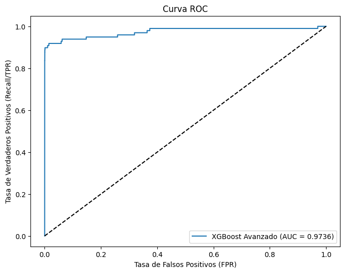
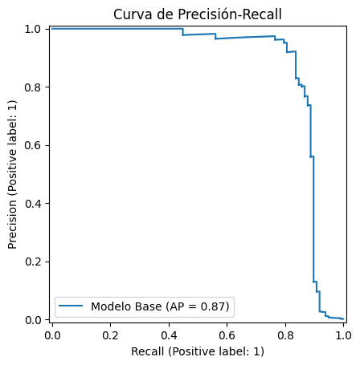

# Proyecto: Detección de Fraude en Tarjetas de Crédito con KNIME y Python

## 1. Resumen Ejecutivo

Este proyecto aborda el desafío de detectar transacciones fraudulentas en un conjunto de datos de tarjetas de crédito altamente desbalanceado. Se implementó una metodología híbrida, utilizando **KNIME Analytics Platform** para un rápido prototipado y optimización de un modelo base, y posteriormente **Python** para realizar una ingeniería de características avanzada y refinar el modelo.

El resultado final es un modelo robusto en Python que, gracias a la ingeniería de características, alcanzó un **Recall del 83.7%** en la detección de fraudes, superando el ya sólido benchmark del 88.8% de Precisión y 80.6% de Recall obtenido en KNIME.

---
## 2. El Problema: El Desafío de los Datos Desbalanceados

El punto de partida fue un conjunto de datos público de Kaggle con 284,807 transacciones, de las cuales solo **492 (un 0.17%)** eran fraudulentas. Este extremo desbalance es el principal reto técnico, ya que un modelo ingenuo podría alcanzar una precisión superior al 99% simplemente clasificando todas las transacciones como "normales", siendo completamente inútil para el negocio.

El objetivo principal, por tanto, fue maximizar la métrica **Recall** mientras se mantenía una Precisión aceptable para minimizar las falsas alarmas.

---
## 3. Metodología Híbrida: KNIME + Python

El proyecto se dividió en dos fases estratégicas para aprovechar lo mejor de ambas herramientas:

* **Fase 1 (KNIME):** Utilizar la interfaz visual de KNIME para explorar los datos rápidamente, construir un pipeline de preprocesamiento y entrenar un modelo `XGBoost` con un bucle de optimización para establecer un benchmark sólido.
* **Fase 2 (Python):** Migrar el flujo de trabajo a un Jupyter Notebook en VSCode para aplicar técnicas de **Ingeniería de Características** más complejas, refinar el modelo y generar visualizaciones avanzadas.

---
## 4. Resultados y Comparativa Final

La tabla a continuación resume la evolución del rendimiento del modelo a lo largo del proyecto, demostrando el valor de cada etapa de mejora.

| Modelo | Herramienta | Recall (Fraudes Atrapados) | Precisión (Calidad de Alertas) |
| :--- | :--- | :--- | :--- |
| 1. Random Forest (Base) | KNIME | 75.5% | 91.4% |
| 2. XGBoost Optimizado | KNIME | 80.6% | 88.8% |
| 3. **XGBoost + Feat. Eng.** | **Python** | **83.7%** | **89.1%** |

---
## 5. Visualizaciones Clave del Modelo Ganador (Python)

Las siguientes gráficas resumen el rendimiento del modelo final y avanzado de Python:

* **Matriz de Confusión Visual:** Muestra claramente el rendimiento del modelo. De los 98 fraudes en el conjunto de prueba, el modelo **atrapó 82** y solo se le escaparon 16, generando únicamente 10 falsas alarmas.

    

* **Curva ROC:** Evalúa el rendimiento global del clasificador. El modelo alcanzó un **Área Bajo la Curva (AUC) de 0.9736**, un valor excepcional que indica una alta capacidad para distinguir entre clases.

    

* **Curva de Precisión-Recall:** Esencial para datasets desbalanceados, el modelo mantiene una alta precisión a medida que aumenta el recall, logrando un **Área Bajo la Curva (AP) de 0.87**.

    

---
## 6. Cómo Replicar el Proyecto

1.  **Entorno KNIME:** El workflow `02_Modelado_Avanzado_KNIME.knwf` (ubicado en la carpeta `knime_workflows`) contiene el proceso completo de optimización. Se requieren las extensiones de XGBoost y las de visualización de JavaScript.
2.  **Entorno Python:** El notebook `analisis_avanzado.ipynb` (en la carpeta `notebooks`) contiene el código final. Para ejecutarlo, cree un entorno virtual y ejecute `pip install -r requirements.txt` (es buena práctica crear este archivo con las librerías).

---
## 7. Conclusión

Este proyecto demuestra con éxito la construcción de un modelo de detección de fraude de alto rendimiento a través de un enfoque híbrido. Se validó una solución rápidamente en **KNIME** y luego se llevó a un nivel superior de rendimiento en **Python** mediante ingeniería de características avanzada. El modelo final es capaz de detectar el **83.7%** de las transacciones fraudulentas manteniendo una alta fiabilidad en sus alertas (89.1% de Precisión).